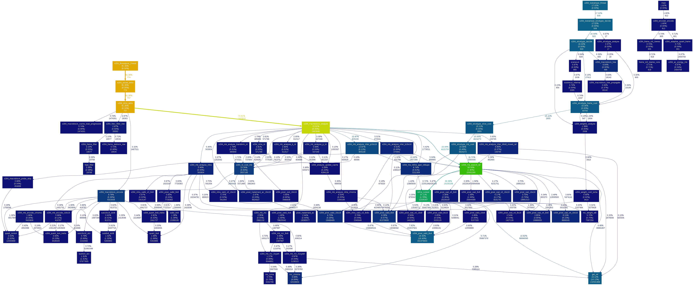

# 性能测试

性能测试通常是对软件计算用时进行测试和分析，这里主要针对计算时间和基准性能测试给出一个服务的计算能力和服处理务能力。

## gprof

gprof 可以为 Linux平台上的程序精确分析性能瓶颈。gprof精确地给出函数被调用的时间和次数，给出函数调用关系。gprof能够让你知道你的代码哪些地方是比较耗时的，哪些函数是被调用次数很多的，并且能够让你一目了然的看到函数与函数之间的调用关系。

gprof是gcc/g++编译器支持的一种性能诊断工具。只要在编译时加上-pg选项，编译器就会在编译程序时在每个函数的开头加一个mcount函数调用，在每一个函数调用之前都会先调用这个mcount函数，在mcount中会保存函数的调用关系图和函数的调用时间和被调次数等信息。最终在程序退出时保存在gmon.out文件中，需要注意的是程序必须是正常退出或者通过exit调用退出，因为只要在exit（）被调用时才会触发程序写gmon.out文件。

gprof 用户手册网站 http://sourceware.org/binutils/docs-2.17/gprof/index.html 。Gprof 是GNU gnu binutils工具之一，默认情况下linux系统当中都带有这个工具。

### 使用指南
gprof的使用方法主要以下三步：
```
会用-pg参数编译程序
运行程序，并正常退出，回升呈gmon.out文件
使用gprof来分析gmon.out文件
```
gprof工具的基本使用方式：
```
gprof –b a.out gmon.out >report.txt
```
gprof的参数信息说明：
```
-b 不再输出统计图表中每个字段的详细描述。
-p 只输出函数的调用图（Call graph的那部分信息）。
-q 只输出函数的时间消耗列表。
-e Name 不再输出函数Name 及其子函数的调用图（除非它们有未被限制的其它父函数）。可以给定多个 -e 标志。一个 -e 标志只能指定一个函数。
-E Name 不再输出函数Name 及其子函数的调用图，此标志类似于 -e 标志，但它在总时间和百分比时间的计算中排除了由函数Name 及其子函数所用的时间。
-f Name 输出函数Name 及其子函数的调用图。可以指定多个 -f 标志。一个 -f 标志只能指定一个函数。
-F Name 输出函数Name 及其子函数的调用图，它类似于 -f 标志，但它在总时间和百分比时间计算中仅使用所打印的例程的时间。可以指定多个 -F 标志。一个 -F 标志只能指定一个函数。-F 标志覆盖 -E 标志。
-z 显示使用次数为零的例程（按照调用计数和累积时间计算）。
```
gprof生成的report.txt基本信息说明:

| name | %time | Cumulative seconds | Self Seconds | Calls Self | TS/call |
| -- | -- | -- | -- | -- | -- | -- | -- |
| 函数名 | 该函数消耗时间占程序所有时间百分比 | 程序的累积执行时间 | 该函数本身执行时间 | 函数被调用次数 | 函数平均执行时间 |

> 注意：
程序的累积执行时间只是包括gprof能够监控到的函数。工作在内核态的函数和没有加-pg编译的第三方库函数是无法被gprof能够监控到的，（如sleep（）等）
Gprof 的具体参数可以 通过 man gprof 查询。

当然有图形话的工具来生成调用关系图，并给出整个函数的使用时间和调用次数。
```
生成图片
   //安装画图工具
   sudo apt-get install graphviz  
   gprof a.out  | ./gprof2dot.py -n0 -e0 | dot -Tpng -o output.png 
   python gprof2dot.py prof.txt | dot -Tpng -o prof.png 
```
下图是在对x264源码加速分析时的一个示例：



### Q&A
* 共享库的支持

  对于代码剖析的支持是由编译器增加的，因此如果希望从共享库中获得剖析信息，就需要使用 -pg 来编译这些库。提供已经启用代码剖析支持而编译的 C 库版本（libc_p.a）。
 如果需要分析系统函数（如libc库），可以用 –lc_p替换-lc。这样程序会链接libc_p.so或libc_p.a。这非常重要，因为只有这样才能监控到底层的c库函数的执行时间，（例如memcpy()，memset()，sprintf()等）。
 ```
gcc example1.c –pg -lc_p -o example1
注意要用ldd ./example | grep libc来查看程序链接的是libc.so还是libc_p.so
```

* 关于用户时间与内核时间:

  gprof 的最大缺陷：它只能分析应用程序在运行过程中所消耗掉的用户时间，无法得到程序内核空间的运行时间。通常来说，应用程序在运行时既要花费一些时间来运行用户代码，也要花费一些时间来运行 “系统代码”，例如内核系统调用sleep()。
  
  有一个方法可以查看应用程序的运行时间组成，在 time 命令下面执行程序。这个命令会显示一个应用程序的实际运行时间、用户空间运行时间、内核空间运行时间。
```
如 time ./program
输出：
real    2m30.295s
user    0m0.000s
sys     0m0.004s
```

> 注意事项
1. g++在编译和链接两个过程，都要使用-pg选项。
2. 只能使用静态连接libc库，否则在初始化*.so之前就调用profile代码会引起“segmentation fault”，解决办法是编译时加上-static-libgcc或-static。
3. 如果不用g++而使用ld直接链接程序，要加上链接文件/lib/gcrt0.o，如ld -o myprog /lib/gcrt0.o myprog.o utils.o -lc_p。也可能是gcrt1.o
4. 要监控到第三方库函数的执行时间，第三方库也必须是添加 –pg 选项编译的。
5. gprof只能分析应用程序所消耗掉的用户时间.
6. 程序不能以demon方式运行。否则采集不到时间。（可采集到调用次数）
7. 首先使用 time 来运行程序从而判断 gprof 是否能产生有用信息是个好方法。
8. 如果 gprof 不适合您的剖析需要，那么还有其他一些工具可以克服 gprof 部分缺陷，包括 OProfile 和 Sysprof。
9. gprof对于代码大部分是用户空间的CPU密集型的程序用处明显。对于大部分时间运行在内核空间或者由于外部因素（例如操作系统的 I/O 子系统过载）而运行得非常慢的程序难以进行优化。
10. gprof 不支持多线程应用，多线程下只能采集主线程性能数据。原因是gprof采用ITIMER_PROF信号，在多线程内只有主线程才能响应该信号。但是有一个简单的方法可以解决这一问题：http://sam.zoy.org/writings/programming/gprof.html
11. gprof只能在程序正常结束退出之后才能生成报告（gmon.out）。
a) 原因： gprof通过在atexit()里注册了一个函数来产生结果信息，任何非正常退出都不会执行atexit()的动作，所以不会产生gmon.out文件。
b) 程序可从main函数中正常退出，或者通过系统调用exit()函数退出。

## benchmark

https://github.com/google/benchmark

Benchmark测试在计算机领域中最广泛和最成功的应用是性能测试，主要测试响应时间、传输速率和吞吐量等。

## 负载测试

## 其他测试

对于系统级服务，特别是商业中的使用，还要考虑到可靠性可用性测试。

