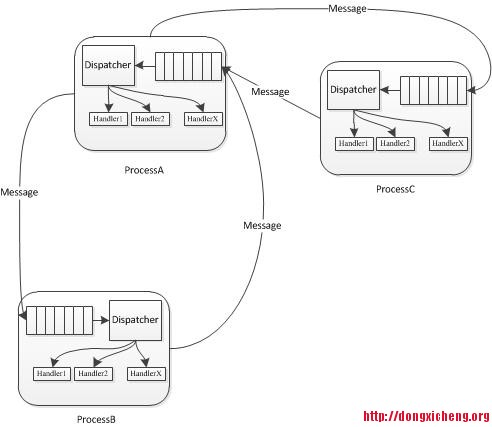

# 通信库libprocess

Libprocess是一个用c++的库，提供了一个Actor风格消息传递编程模型,利用高效的操作系统事件机制。Libprocess Erlang的流程模型非常相似,包括发送和接收消息的基本构造。

LibProcess采用了基于事件驱动的编程模型，每一个服务（进程）内部实际上运行了一个socket server，而不同服务之间通过消息（事件）进行通信。在一个服务内部，注册了很多消息以及每个消息对应的处理器，一旦它收到某种类型的消息，则会调用相应的处理器进行处理，在处理过程中，可能会产生另外一种消息发送给另一个服务。



## 基本概念


## 基本用法

首先给出一个参考实例：摘自官方github example
```
#include <iostream>
#include <sstream>

#include <process/defer.hpp>
#include <process/dispatch.hpp>
#include <process/future.hpp>
#include <process/http.hpp>
#include <process/process.hpp>

using namespace process;

using namespace process::http;

using std::string;

class MyProcess : public Process<MyProcess>
{
public:
  MyProcess() {}
  virtual ~MyProcess() {}

  Future<int> func1()
  {
    promise.future().onAny(
        defer([=] (const Future<int>& future) {
          terminate(self());
        }));
    return promise.future();
  }

  void func2(int i)
  {
    promise.set(i);
  }

  Future<Response> vars(const Request& request)
  {
    string body = "... vars here ...";
    OK response;
    response.headers["Content-Type"] = "text/plain";
    std::ostringstream out;
    out << body.size();
    response.headers["Content-Length"] = out.str();
    response.body = body;
    return response;
  }

  void stop(const UPID& from, const string& body)
  {
    terminate(self());
  }

protected:
  virtual void initialize()
  {
//     route("/vars", &MyProcess::vars);
    route("/vars", [=] (const Request& request) {
        string body = "... vars here ...";
        OK response;
        response.headers["Content-Type"] = "text/plain";
        std::ostringstream out;
        out << body.size();
        response.headers["Content-Length"] = out.str();
        response.body = body;
        return response;
      });

//     install("stop", &MyProcess::stop);
    install("stop", [=] (const UPID& from, const string& body) {
        terminate(self());
      });
  }

private:
  Promise<int> promise;
};


int main(int argc, char** argv)
{
  MyProcess process;
  PID<MyProcess> pid = spawn(&process);

  PID<> pid2 = pid;

// --------------------------------------

//   Future<int> future = dispatch(pid, &MyProcess::func1);
//   dispatch(pid, &MyProcess::func2, 42);

//   std::cout << future.get() << std::endl;

//   post(pid, "stop");

// --------------------------------------

//   Promise<bool> p;

//   dispatch(pid, &MyProcess::func1)
//     .then([=, &p] (int i) {
//         p.set(i == 42);
//         return p.future();
//       })
//     .then([=] (bool b) {
//         if (b) {
//           post(pid, "stop");
//         }
//         return true; // No Future<void>.
//       });

//   dispatch(pid, &MyProcess::func2, 42);

// --------------------------------------

  dispatch(pid, &MyProcess::func1);
  dispatch(pid, &MyProcess::func2, 42);


  wait(pid);
  return 0;
}
```
libprocess中的几个类说明：
```
（1）Process类
可通过继承该类，实现一个服务。该类主要包含以下几个方法：
1）  Install函数
void install(
const std::string& name,
const MessageHandler& handler)
注册名为name的消息处理器。
2） Send函数
void send(
const UPID& to,
const std::string& name,
const char* data = NULL,
size_t length = 0)
向参数to标识的服务发送名为name的消息，该消息中包含数据data，长度为length。
（2）使用ProtobufProcess类
ProtobufProcess类实现了Process类，与Protocal buffer紧密结合，该类主要有以下几个方法：
1） Install函数
使用ProtobufProcess类，可以很容易创建一个处理Protocal buffer类型消息的消息处理器，可通过install函数注册各种消息处理器，比如如果一个新消息中有2个字段（x1，x2），则可这样注册该消息：
install<XXXMessage>(  //使用install函数进行注册
&messageHandler,
&x1，&x2);
}
XXXMessage的protocal buffer定义如下：
message XXXMessage {
required X x1 = 1;
required Y x2 = 2;
}
2）   send函数
定义如下：
void send(const process::UPID& to,
const google::protobuf::Message& message);
它的功能是向参数to标识的服务发送message消息，其中to是UPID类型，它包含了服务ip和端口号。
3）   reply函数
定义如下：
void reply(const google::protobuf::Message& message);
功能：向最近发送消息的服务返回message。
（3）全局函数
1）  dispatch
存在多种定义方式，一种方式如下：
template <typename R, typename T>
Future<R> dispatch(
const PID<T>& pid,
Future<R> (T::*method)(void))
将函数分配给pid进程（服务）执行。注意，函数分配给进程后，不一定会马上执行完后，需要需要等待执行完成，可以结合wait函数使用：
Future<bool> added = dispatch(slavesManager, add);
added.await();
if (!added.isReady() || !added.get()) {
…..
}
2）  spawn
定义如下：
UPID spawn(ProcessBase* process, bool manage=false)；
启动进程（服务）process，参数manage表示是否启用垃圾收集机制。
```
## 入门实例
```
假设有两个服务Master和Slave，Slave周期性向Master汇报自己的进度，而Master则不定期地向Slave下达任务，采用LibProcess实现如下：
（1）Master类设计
步骤1 继承ProtobufProcess类。让Master类继承LibProcess中的ProtobufProcess类，该类实际上维护了一个socket server，该server可以处理实现注册好的各种Protocal Buffer定义的Message
class Master : public ProtobufProcess<Master> {
//……
}
步骤2 注册消息处理器。在初始化函数initialize()中（使用install函数）注册一个ReportProgressMessage类型（需使用Protocal buffer定义）的消息处理器，该消息处理器对应的函数是Master::reportProgress，该函数带有一个参数tasks。这样，Master内部的socket server会监听来自外部的各种消息包，一旦发现ReportProgressMessage类型的消息包，则会调用函数reportProgress进行处理。注意，reportProgress函数中的参数必须正好对应ReportProgressMessage消息定义。
void initialize() { //继承ProtobufProcess类后，需实现该函数
install<ReportProgressMessage>(  //使用install函数进行注册
&Master::reportProgress,
&LaunchTasksMessage::tasks);
}
步骤3 定义ReportProgressMessage消息。使用Protocal Buffer定义ReportProgressMessage消息如下：
//master.proto
message ReportProgressMessage {
repeated Task tasks = 3;
}
message Task {
required string name = 1;
required TaskID task_id = 2;
required float progress =3;
}
message TaskID {
required string value = 1;
}
步骤4 编写消息处理器reportProgress。
void reportProgress(const vector<Task>& tasks) {
for (int i = 0; i < tasks.size(); i++) {
//update tasks[i] information;
}
步骤5 编写main函数启动Master。
int main(int argc, char** argv)
{
process::initialize(“master”); //初始化一个名为master的进程
Master* master = new Master();
process::spawn(master); //启动master，实际上是一个socket server
process::wait(master->self());
delete master;
return 0;
}
比较全的代码如下：
class Master : public ProtobufProcess<Master> //步骤1
{
Master(): ProcessBase(“master”) {}
void initialize() {
install<ReportProgressMessage>(  //步骤2
&Master::reportProgress,
&LaunchTasksMessage::tasks);
}
void reportProgress(const vector<Task>& tasks) { //步骤4
for (int i = 0; i < tasks.size(); i++) {
//update tasks[i] information;
}
}
}
（2）       Slave类设计
Slave设计与Master类似，具体如下：
class Slave : public ProtobufProcess<Slave>
{
Slave(): ProcessBase(“slave”) {}
void initialize() [
install<LaunchTasksMessage>(
&Master::launchTasks,
&LaunchTasksMessage::id,
&LaunchTasksMessage::tasks);
}
void launchTasks(const int id,
const vector<TaskInfo>& tasks) {
for (int i = 0; i < tasks.size(); i++) {
//launch tasks[i];
}
}
}
```

## 高级用法


参考：

http://dongxicheng.org/apache-mesos/mesos-libprocess/
http://www.eecs.berkeley.edu/~benh/libprocess/
https://github.com/3rdparty/libprocess